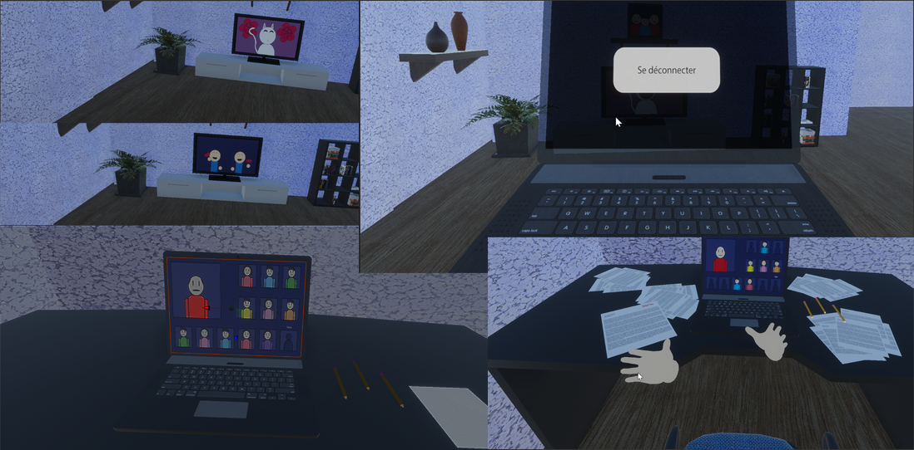
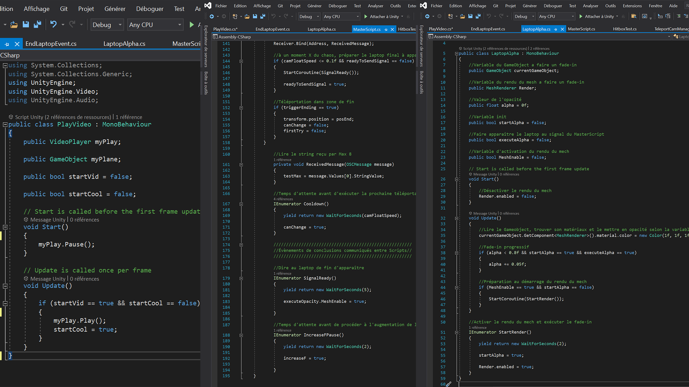
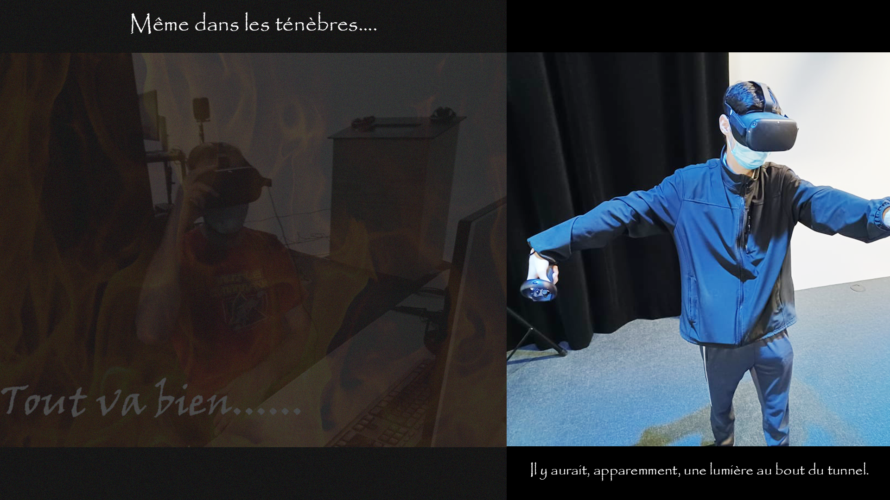

# Journal de création

## Semaine 9

## Semaine 8

## Semaine 7

En bref, l'architecture et l'ameublement de la maison sont fini, les animations du prof et les cartoons sont intégrés, intégrations sonores réalisées, code pour l'apparition, de manière périodique, des paquets de feuilles de la feuille d'examen, du changement de la photo de famille du salon, réparation du laptop de déconnexion, intégration des modélisations manquantes, et corrections massives de bogues divers.

## Semaine 6

En bref, pour ma part (WD), débogage d'Unity, affichage d'une vidéo avec du son sur un mesh, communications interscript et apparition d'un objet 3D en opacité.

Espace physique toujours en développement.

## Semaine 5

En bref, les lumières ont été installées au plafond, la kinect a été testée et installée, et quelques prototypes de VR ont pu être réalisés, mais dans un temps anormalement astronomique, problèmes techniques de type informatiques et psychologiques.

## Semaine 4

En résumé, le projecteur a été installé au plafond, les presets de lumières ont été finalisés, le schéma de branchement a été finalisé, puis le casque Vr peut enfin se connecter à Unity.

## Semaine 3

Premièrement, l'équipement a été réservé et placé. Ghislain a commencé à expérimenter les lumières DMX, alors que William tente de connecter son casque VR dans Unity, mais sans succès pour des problèmes techniques hors de son contrôle. En attendant, il a commencé ses modélisations 3D.

## Semaine 2

En premier lieu, nous avons finalisé le scénario plan par plan. Ensuite, nous avons complété the Storyboard, et nous avons trouvé un titre. Finalement, nous allons compléter la préproduction, corriger les problèmes soulevés par les professeurs, et nous allons conclure le Moodboard.

## Semaine 1

Tout d’abord, comme prévu, nous avons terminé de créer l'intention, le synopsis et le moodboard.

Par la suite, nous avons complété le scénario plan par plan. 

Enfin, nous avons planifié les éléments à continuer la semaine prochaine, soit le storyboard et faire la liste des matériaux nécessaires et schéma de branchement. Nous avons hâte de nous mettre à la tâche!

