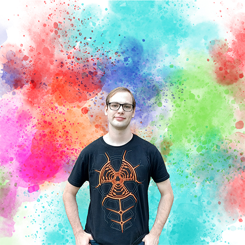
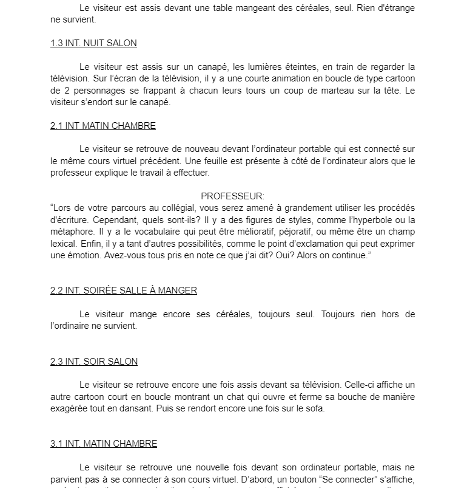
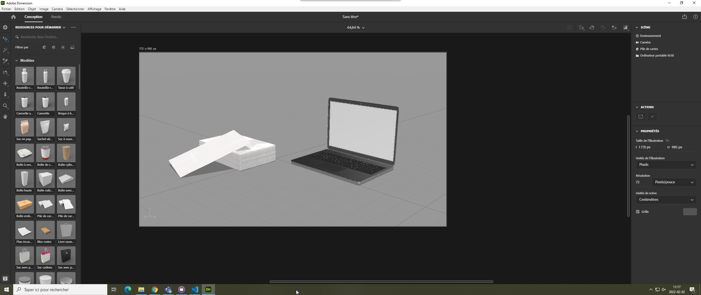
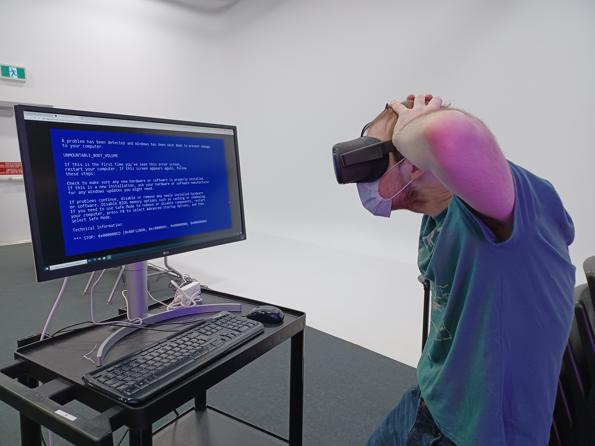
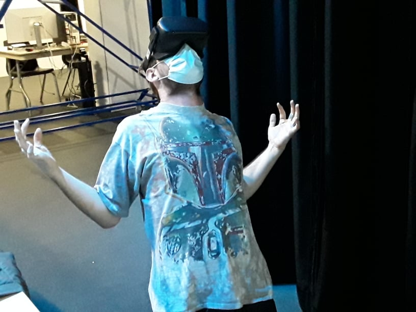
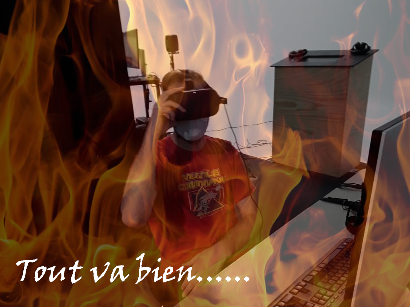
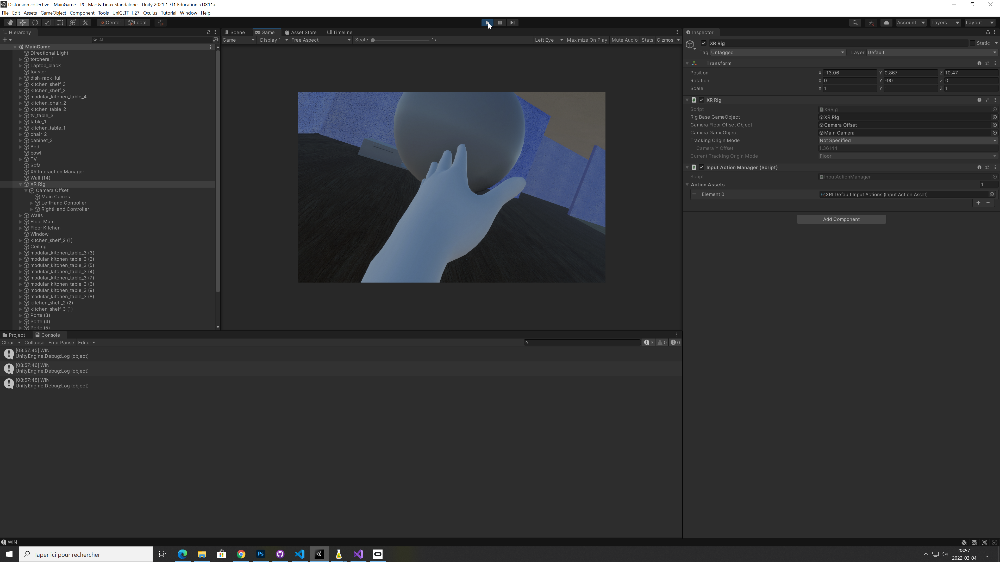
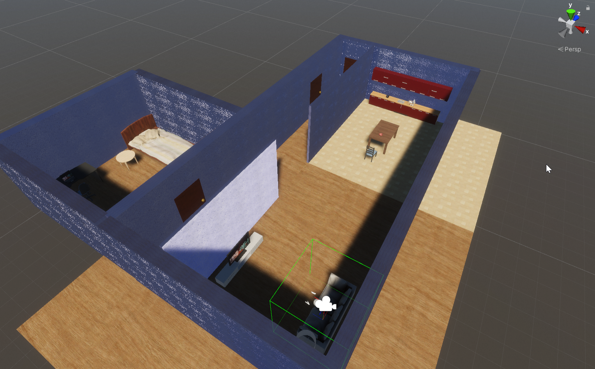
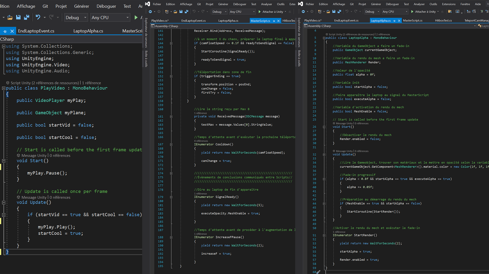
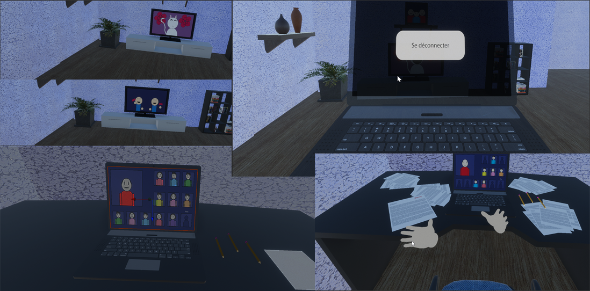

# Journal de William Dubois

* [Semaine 1](#semaine-1)
* [Semaine 2](#semaine-2)
* [Semaine 3](#semaine-3)
* [Semaine 4](#semaine-4)
* [Semaine 5](#semaine-5)
* [Semaine de rattrapage](#semaine-de-rattrapage)
* [Semaine 6](#semaine-6)
* [Semaine 7](#semaine-7)
* [Semaine 8](#semaine-8)
* [Semaine 9](#semaine-9)

## Semaine 1

### Résumé des réalisations effectuées
- Mise à jour du template GitHub.
- Réaliser l'intention, le synopsis, le scénario court et le scénario plan par plan.
- Organiser le temps de travail pour la semaine 2.

### Image d'une réalisation dont tu es la ou le plus fier

### Est-ce que j'ai accompli l'ensemble des tâches et objectifs que je m'étais fixés pour cette semaine?	
- [X] Complètement
- [ ] Assez
- [ ] Peu
- [ ] Pas du tout

#### Décrivez pourquoi.
Car j'ai pu réaliser mon intention, mon synopsis, le scénario court et le scénario plan par plan. Je n'aurai pas pensé pouvoir faire tout cela avant vendredi, mais j'ai réussi.

#### S'il y a lieu, qu'allez-vous faire pour remédier à la situation?
N/A

### Mon projet s'est-il réalisé selon l’échéancier prévu?

- [X] Complètement
- [ ] Assez
- [ ] Un peu
- [ ] Pas tout à fait

#### S'il y a des écarts, décrivez-les.
N/A

#### S'il y a lieu, qu'allez-vous faire pour remédier à la situation?
N/A

### Défis pour la prochaine semaine
Réaliser le storyboard ce lundi et remettre un GitHub plus à jour pour la semaine 2 le plus possible.

---
## Semaine 2
### Résumé des réalisations effectuées
Cela a été une semaine chargé en béton indestructible. En peu de temps, le scénario court, le scénario plan par plan, le Moodboard, le Storyboard, ainsi que le schéma de plantation ont été réalisés. En plus, d'avoir commencé quelques éléments du reste de la préproduction et d'avoir corrigé quelques erreurs soulignées par les professeurs.

### Image d'une réalisation dont tu es la ou le plus fier

### Est-ce que j'ai accompli l'ensemble des tâches et objectifs que je m'étais fixés pour cette semaine?

- [X] Complètement
- [ ] Assez
- [ ] Peu
- [ ] Pas du tout

#### Décrivez pourquoi.
 Tous les éléments de la section de la préproduction (Intention, synopsis, scénario court, scénario plan par plan, Moodboard et Storyboard) ont été réalisés dans le temps préétablis. Maintenant, il ne reste qu'à finir ce qui reste.

#### S'il y a lieu, qu'allez-vous faire pour remédier à la situation?
N/A

### Mon projet s'est-il réalisé selon l’échéancier prévu?

- [X] Complètement
- [ ] Assez
- [ ] Un peu
- [ ] Pas tout à fait

#### S'il y a des écarts, décrivez-les.
N/A

#### S'il y a lieu, qu'allez-vous faire pour remédier à la situation?
N/A

### Défis pour la prochaine semaine
Compléter la préproduction au complet avec tous les correctifs relevés mercredi dernier, enfin de sa remise finale ce mercredi. Une bonne organisation et communication d'équipe seront requises afin d'y parvenir.

---
## Semaine 3 
### Résumé des réalisations effectuées
Création de la section des médias à intégrer (créer), de la section des contraintes potentielles et des solutions envisagées, un échéancier, plusieurs autres sections et quelques corrections de la préproduction enfin de sa présentation aux professeurs.

### Image d'une réalisation dont tu es la ou le plus fier

### Est-ce que j'ai accompli l'ensemble des tâches et objectifs que je m'étais fixés pour cette semaine?

- [X] Complètement
- [ ] Assez
- [ ] Peu
- [ ] Pas du tout

#### Décrivez pourquoi.
 Toutes les tâches ont été réalisées dans les délais en s'assurant de ne rien oublier grâce à la création d'issues de tous les éléments à compléter dans les temps.

#### S'il y a lieu, qu'allez-vous faire pour remédier à la situation?
N/A

### Mon projet s'est-il réalisé selon l’échéancier prévu?

- [X] Complètement
- [ ] Assez
- [ ] Un peu
- [ ] Pas tout à fait

#### S'il y a des écarts, décrivez-les.
N/A

#### S'il y a lieu, qu'allez-vous faire pour remédier à la situation?
N/A

### Défis pour la prochaine semaine
Remettre finalement la préproduction dans les temps pour mercredi, et commencer mes prototypes que je me suis fixé de faire dans les plus brefs délais avant de commencer la production.

---
## Semaine 4
### Résumé des réalisations effectuées
Connexion du casque VR à l'ordinateur miraculeusement réussie. Rien d'autre n'a pu être effectué par difficultés informatiques.

### Image d'une réalisation dont tu es la ou le plus fier

### Est-ce que j'ai accompli l'ensemble des tâches et objectifs que je m'étais fixés pour cette semaine?

- [ ] Complètement
- [X] Assez
- [ ] Peu
- [ ] Pas du tout

#### Décrivez pourquoi.
 Le prototypage ne pouvait commencer jusqu'à ce que le problème de connexion entre le casque VR et Unity soit réglé.

#### S'il y a lieu, qu'allez-vous faire pour remédier à la situation?
Réorganiser mon temps alloué sur mes tâches, enfin de prioriser les tests les plus urgents tout en minimisant l'impact sur l'échéancier.

### Mon projet s'est-il réalisé selon l’échéancier prévu?

- [ ] Complètement
- [X] Assez
- [ ] Un peu
- [ ] Pas tout à fait

#### S'il y a des écarts, décrivez-les.
Les prototypes ont été retardés par fautes informatiques.

#### S'il y a lieu, qu'allez-vous faire pour remédier à la situation?
Réorganiser mon temps et travailler le plus possible.

### Défis pour la prochaine semaine
Essayer de faire les prototypes de téléportation de caméra, des collisions avec les mains et des GUI en VR. Ainsi, une grosse partie du travail qui peut causer des complications sera déjà réalisé.

---
## Semaine 5
### Résumé des réalisations effectuées
D'abord, j'ai réussi à créer le script qui permet de déplacer la caméra aux positions et moments voulus. Puis, j'ai réussi à faire communiquer Max 8 et Unity ensemble. Enfin, j'ai pu intégrer les manettes dans une scène Unity sous forme de mains 3D.

### Image d'une réalisation dont tu es la ou le plus fier

### Est-ce que j'ai accompli l'ensemble des tâches et objectifs que je m'étais fixés pour cette semaine?

- [ ] Complètement
- [ ] Assez
- [X] Peu
- [ ] Pas du tout

#### Décrivez pourquoi.
Le casque VR causant toujours capricieux comme d'habitude, peu de travail a pu être réalisé dans le temps accordé.

#### S'il y a lieu, qu'allez-vous faire pour remédier à la situation?
Prioriser la création de l'environnement 3D.

### Mon projet s'est-il réalisé selon l’échéancier prévu?

- [ ] Complètement
- [ ] Assez
- [ ] Un peu
- [X] Pas tout à fait

#### S'il y a des écarts, décrivez-les.
Toujours des problèmes de casque VR qui ralentit le prototypage et la production.

#### S'il y a lieu, qu'allez-vous faire pour remédier à la situation?
Prioriser la création de l'environnement 3D, ce qui requit peu de code et qui permet de produire quelque chose du résultat final avec très peu de complications.

### Défis pour la prochaine semaine
Prioriser la production de l'environnement 3D de l'expérience. Donc, dès la semaine prochaine, réaliser la scène Unity commune finale. Une fois ceci fait, je fais prioriser le codage, pour éviter de manquer de temps sur le contenu.

---
## Semaine de rattrapage
### Résumé des réalisations effectuées
- Début de la construction de l'environnement 3D.
- Début de l'ameublement de l'environnement 3D.
- Intégrations de mains 3D dans la scène Unity.
- Détection des collisions entre la main VR et un objet 3D.
- Afficher une vidéo sur un objet 3D (dans ce cas, sur un laptop).
- Recherche et application de matériel pour les objets 3D.
- Recherche et compréhension sur comment faire communiquer des scripts C# vers un script maître (gestionnaire d'évènement).

### Image d'une réalisation dont tu es la ou le plus fier

### Est-ce que j'ai accompli l'ensemble des tâches et objectifs que je m'étais fixés pour cette semaine?

- [X] Complètement
- [ ] Assez
- [ ] Peu
- [ ] Pas du tout

#### Décrivez pourquoi.
 J'avais prévu d'avoir au moins la maison finale pour la fin de cette semaine, mais la réussite des collisions avec les mains VR et de l'affichage vidéo sur des objets 3D fait diminuer la charge de travail et permet de respirer un peu plus.

#### S'il y a lieu, qu'allez-vous faire pour remédier à la situation?

### Mon projet s'est-il réalisé selon l’échéancier prévu?

- [ ] Complètement
- [X] Assez
- [ ] Un peu
- [ ] Pas tout à fait

#### S'il y a des écarts, décrivez-les.
La maison n'est pas finale, mais la création fonctionnelle des prototypes de collisions et d'affichage vidéo compense le tout.

#### S'il y a lieu, qu'allez-vous faire pour remédier à la situation?

### Défis pour la prochaine semaine
- Faire les animations 2D.
- Finir la maison 3D.
- Si possible, commencer le script maître de gestionnaire d'évènements.

---
## Semaine 6
### Résumé des réalisations effectuées
- Jouer une vidéo avec du son sur le laptop et sur la télévision lorsque le bouton "Se connecter" du laptop et touché.
- Faire apparaître en fade in de manière fixe le laptop de déconnexion sur la caméra du joueur pour la fin.
- Faire communiquer les scripts entre elles et le MasterScript.
- Redimensionnement de la maison et ajustement des matériaux.
- Réparations de quelques problèmes de caméra.
- Ajout de nombreux commentaires sur mes scripts.
- Téléportation vers la zone de fin lorsque le bouton "Se déconnecter" est touché.
- Recherche sur comment rouler l'expérience en continu même lorsque le casque est retiré, enfin d'empêcher le projet de briser.

### Image d'une réalisation dont tu es la ou le plus fier

### Est-ce que j'ai accompli l'ensemble des tâches et objectifs que je m'étais fixés pour cette semaine?

- [ ] Complètement
- [ ] Assez
- [ ] Peu
- [X] Pas du tout

#### Décrivez pourquoi.
 Il y a eu une perte de temps astronomique en débogage qui a ainsi ralenti la production de manière radicale.

#### S'il y a lieu, qu'allez-vous faire pour remédier à la situation?
Demander une rencontre d'urgence prioritaire avec les professeurs, enfin d'établir un plan de match stratégique d'intervention pour déterminer sur quoi je dois me concentrer pour la semaine prochaine.

### Mon projet s'est-il réalisé selon l’échéancier prévu?

- [ ] Complètement
- [ ] Assez
- [ ] Un peu
- [X] Pas tout à fait

#### S'il y a des écarts, décrivez-les.
Débogage extrême avec Unity, défaillance des capteurs de proximités du casque Oculus, et étant le seul de l'équipe à trouver les problèmes de code, et les corriger.

#### S'il y a lieu, qu'allez-vous faire pour remédier à la situation?
Demander une rencontre d'urgence avec les professeurs pour déterminer les points critiques du projet à terminer pour la semaine prochaine.

### Défis pour la prochaine semaine
Finir le projet le plus possible pour la semaine prochaine selon les points importants relevés de ma rencontre d'urgence avec les professeurs.

---
## Semaine 7
### Résumé des réalisations effectuées

- Intégrer les animations du prof sur le laptop.
- Intégrer le son de popup de Teams.
- Intégrer les 2 cartoons sur la télévision.
- Intégrer mes dernières modélisations manquantes.
- Ajout d'une augmentation de cadence pour intense.
- Réparation du laptop de déconnexion de fin.
- Fin de la construction et de l'ameublement de la maison.
- Apparition de tas de feuilles périodiquement sur le bureau.
- faire en sorte que le bouton se connecter soit interactif que lorsque Max 8 lui dira de l'être.
- Faire apparaître la page d'examen échoué sur le bureau au moment voulu.
- Faire changer la photo de famille du salon au moment voulu.
- Réparation du problème de gardien du casque Oculus en désactivant ce dernier.
- Création du code pour l'intégration de la musique d'ambiance.
- Correction de nombreux bogues divers.

### Image d'une réalisation dont tu es la ou le plus fier

### Est-ce que j'ai accompli l'ensemble des tâches et objectifs que je m'étais fixés pour cette semaine?

- [ ] Complètement
- [X] Assez
- [ ] Peu
- [ ] Pas du tout

#### Décrivez pourquoi.
 Presque tout ce qui devait être fait pour vendredi a été fait. Il ne manque plus que de travailler sur les sons et les animations, et un peu de peaufinement, et tout sera fini.

#### S'il y a lieu, qu'allez-vous faire pour remédier à la situation?
Une bonne grosse journée de travail est, selon moi, suffisant pour mener à terme ce projet.

### Mon projet s'est-il réalisé selon l’échéancier prévu?

- [ ] Complètement
- [X] Assez
- [ ] Un peu
- [ ] Pas tout à fait

#### S'il y a des écarts, décrivez-les.
Il y a juste quelques manques de communication au niveau des sons et de Max 8, mais réglables sans trop de souci.

#### S'il y a lieu, qu'allez-vous faire pour remédier à la situation?
Travailler sérieusement en une journée devrait être suffisant pour tout finir et tourner la page.

### Défis pour la prochaine semaine

- Faire la vidéo de réalisation.
- Finaliser la page Web du projet.
- Test global de qualité pour s'assurer que rien ne brisera pour la semaine prochaine (Monkey test).
- Finaliser les positions X, Y et Z de la caméra sur l'espace physique final de l'expérience.

## Semaine 8

## Semaine 9
