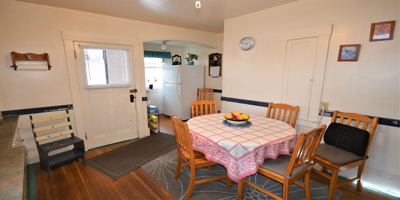
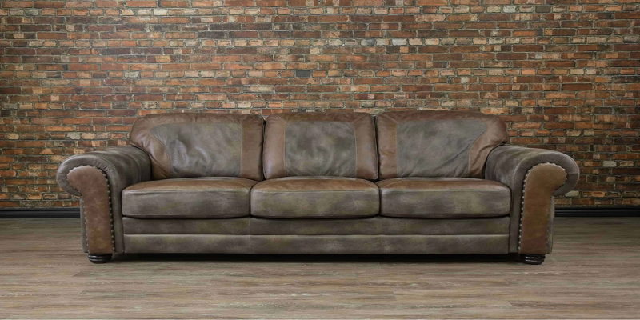
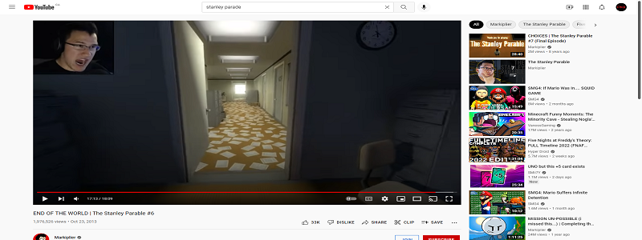
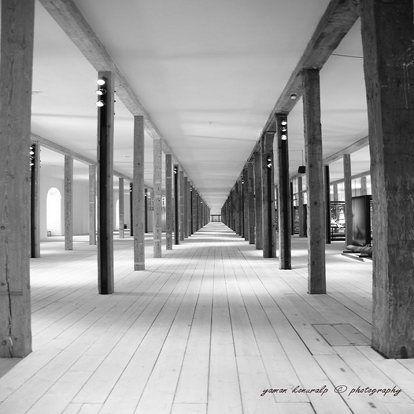
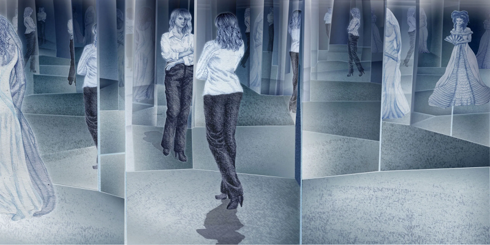
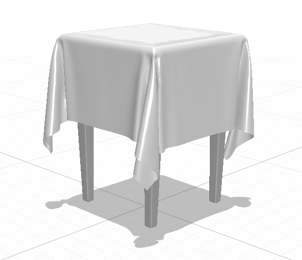
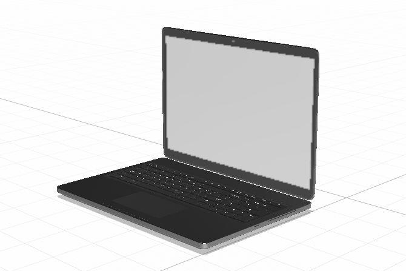
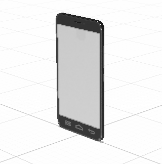

# Préproduction
> C'est ici qu'on dépose les éléments de la préproduction.

# Table des matières
1. [Intention ou concept](#Intention-ou-concept)
    - [Intention de départ](#Intention-de-départ)
    - [Synopsis](#Synopsis)
    - [Tableau d'ambiance (*moodboard*)](#Tableau-d'ambiance-(*moodboard*))
    - [Scénario, scénarimage ou document audio/visuel](#Scénario,-scénarimage-ou-document-audio/visuel)
2. [Contenu multimédia à intégrer](#Contenu-multimédia-à-intégrer)
    - [Inventaire du contenu multimédia](#Inventaire-du-contenu-multimédia)
    - [Univers artistique des éléments](#Univers-artistique-des-éléments-centraux)
3. [Planification technique d'un prototype (devis technique)](#Planification-technique-(devis-technique))
    - [Schémas ou plans techniques](#Schémas-ou-plans-techniques)
    - [Matériaux requis](#Matériaux-de-scénographie-requis)
    - [Équipements requis](#Équipements-requis)
    - [Logiciels requis](#Logiciels-requis)
    - [Ressources humaines requises](#Ressources-humaines-requises)
    - [Ressources spatiales requises (rangement et locaux)](#Ressources-spatiales-requises-(rangement-et-locaux))
    - [Contraintes techniques et potentiels problèmes de production](#Contraintes-techniques-et-potentiels-problèmes-de-production)
4. [Planification de la production d'un prototype (budget et étapes de réalisation)](#Planification-de-la-production-(budget-et-étapes-de-réalisation))
    - [Budget prévisionnel](#Budget-prévisionnel)
    - [Échéancier global](#Échéancier-global)
    - [Liste des tâches à réaliser](#Liste-des-tâches-à-réaliser)
    - [Rôles et responsabilités des membres de l'équipe](#Rôles-et-responsabilités-des-membres-de-l'équipe))
    - [Moments des rencontres d'équipe](#Moments-des-rencontres-d'équipe)

## Intention de départ
Faire comprendre l’évolution de l’angoisse ressentie par un étudiant type et de ses difficultés sociales et scolaires rencontrées au fil des différentes phases du confinement.

## Synopsis
L’expérience commence par la perspective d’un élève qui va commencer ses premiers cours en ligne durant le confinement avec enthousiasme.

Les complications commencent à partir du moment où le professeur se présente, que les travaux s’accumulent, que la personne vit un sentiment d’isolement, et le tout dans une boucle sans fin qui s’accélère périodiquement et qui l’affecte mentalement. À la fin, par un débordement d’anxiété, l’interacteur est appelé à se déconnecter. Se faisant, toute la scène devient noire à l'exception de l’ordinateur (éteint) qui reste toujours visible. 

Enfin, des témoignages/articles de journal sont visibles sur les murs pour sensibiliser le public au stress vécu par un nombre important d’étudiants durant la covid-19.

## Tableau d'ambiance (*moodboard*)
> Ajoutez ici une liste d'images, de vidéos, de documents audios ou multimédias qui vous inspirent. Une palette de couleur ainsi qu'un choix de typographie devraient également s'y trouver selon la nature du projet.
### Moodboard Ambiance Sonore

#### Ambiance avant de mettre le casque vr:
https://www.youtube.com/watch?v=VgbtQJHCtA4
3:41
https://www.youtube.com/watch?v=lr607VaR22c

#### Ambiance après avoir retiré le casque vr:
https://www.youtube.com/watch?v=AjgrI2KmafY

https://www.youtube.com/watch?v=zc8h_GJT2M8

> Insérez directement des captures d'écran et liens vers des médias ici.

### Chambre

### Salle à manger

### Salon

[Lien vers la vidéo YouTube](https://www.youtube.com/watch?v=-T4bmlCQS9c#t=2m58s)

### Matériel (Mesh)

### Images angoissantes

[Lien YouTube vers cette vidéo](https://www.youtube.com/watch?v=NoJlVALDSGM#t=17m12s)

### Projet vidéo

[Référence vidéo d'un projet d'équipe dans le cadre du cours Conception vidéo lors de la session hiver 2019](https://youtu.be/mi1dX7AC9r4)

### Voix robotisées

[Site Web gratuit pour convertir texte en voix dans plusieurs langues et téléchargeable en fichier mp3](https://freetts.com/Home/)

## Scénario, scénarimage ou document audio/visuel

### Scénario (Version Courte)

Le visiteur rentre dans une pièce colorée bleu pâle avec une musique relaxante. Une vidéo est projetée sur le mur, elle montre une conversation d’un téléphone mobile entre deux adolescents contents d’une semaine sans école. On apprend au travers de cette discussion que des cours à distance débuteront sous peu. Les messages à ce sujet sont enthousiastes. Lorsque les messages s'arrêtent, une lumière sur le bureau au centre de la pièce avec un casque VR s’allume, indiquant au visiteur le prochain aspect de l’expérience. Le visiteur peut alors s'asseoir au bureau et mettre le casque.

-----------------------------

Une fois que le visiteur a enfilé le casque, le visiteur se retrouve assis sur une chaise avec devant lui un bureau tenant un ordinateur portable qui diffuse une classe scolaire Zoam (Zoom/Team fictive). Le professeur fictif de cette classe se présente et explique les travaux à faire prochainement. Après un court moment, une transition au noir fade-in fade-out amène le visiteur assis sur le sofa dans le salon regardant les nouvelles sur la télévision. Après une autre transition au noire, le visiteur se réveille le matin, déjeune dans la cuisine, assiste à son cours en ligne devant son ordinateur portable dans sa chambre, écoute la télévision le soir, se rendort. À partir de là, une boucle temporelle répétitive s’observe. Après quelques boucles, le chaos commence progressivement à prendre forme. Tout en accélérant périodiquement la vitesse de délai entre les transitions de la boucle, la voix du professeur commence à devenir robotique, des piles de feuilles de travail se remplissent davantages dans la chambre, les caméras des élèves de la classe virtuelle se désactivent graduellement par un avatar avec le texte “Déconnecté”, les textures des toasts du visiteur sont visuellement des feuilles d’examen. Puis à un certain point, ce chaos amènera même le professeur à enseigner les pieds au plafond, de parler dans des langues étrangères, et même à apparaître et à donner son cours dans la chambre du visiteur. À cette phase, une option “Se Déconnecter” apparaît sur l’écran de l’ordinateur portable. Quand le joueur appuie sur cette option, tout le chaos prend fin, visuellement comme à l’oreille, et la pièce devient subitement noire, et la seule chose qui reste visible est l’ordinateur portable.

-----------------------------

Lorsque le casque montre l’ordinateur portable seul, les lumières extérieures deviennent rouges, alternant de vif à foncer. Sur le(s) mur(s), on aperçoit divers témoignages et articles de journaux apparaître l’un après l’autre. Une conversation sur un téléphone mobile est présente, les mêmes adolescents parlent d’un nouveau variant faisant surface, comment la situation ne semble pas s'améliorer. On finit sur une note plus sombre alors que le casque VR est éclairé à nouveau, à côté de piles de travaux. Si on remet le casque, on peut voir le message “Recommencer?”(ça peut être autre chose) L’expérience se termine.

## Scénario plan par plan

### 0.1 INT APRÈS-MIDI GRAND STUDIO

Le visiteur rentre dans une pièce colorée bleu pâle avec une musique relaxante. Une vidéo est projetée sur le mur, elle montre une conversation d’un téléphone mobile entre deux adolescents contents d’une semaine sans école. On apprend au travers de cette discussion que des cours à distance débuteront sous peu. Les messages à ce sujet sont enthousiastes. Lorsque les messages s'arrêtent, une lumière sur le bureau au centre de la pièce avec un casque VR s’allume, indiquant au visiteur le prochain aspect de l’expérience. Le visiteur peut alors s'asseoir au bureau et mettre le casque.

### 1.1 INT. MATIN CHAMBRE

Le visiteur se retrouve, dans sa chambre, devant un ordinateur portable. L’écran de celle-ci affiche une page Zoam avec un bouton “Appuyer pour se connecter” demandant une interaction avec le visiteur. Une fois ce bouton appuyé, l’interface Zoam affiche une session de classe en ligne en direct avec des webcams ouvertes dont celle du professeur. Celui-ci se présente.

### **PROFESSEUR:** 

“Bonjour, bienvenue dans votre cours de français, aujourd’hui, nous verrons ensemble le plan de cours de cette session. Vu cette situation exceptionnelle de la pandémie, les travaux présents cette année ont été révisés afin de s’assurer de ne pas donner une trop lourde charge de travail. Ceci étant dit, n’en profitez pas pour négliger vos responsabilités en pensant qu’un cours à distance voudrait dire plus de relâchement. Vous risqueriez d’être surpris.”

### 1.2 INT. SOIRÉE SALLE À MANGER

Le visiteur est assis devant une table mangeant des céréales, seul. Rien d'étrange ne survient.

### 1.3 INT. NUIT SALON

Le visiteur est assis sur un canapé, les lumières éteintes, en train de regarder la télévision. Sur l’écran de la télévision, il y a une courte animation en boucle de type cartoon de 2 personnages se frappant à chacun leurs tours un coup de marteau sur la tête. Le visiteur s’endort sur le canapé.

### 2.1 INT MATIN CHAMBRE

Le visiteur se retrouve de nouveau devant l’ordinateur portable qui est connecté sur le même cours virtuel précédent. Une feuille est présente à côté de l’ordinateur alors que le professeur explique le travail à effectuer.

### **PROFESSEUR:** 
“Lors de votre parcours au collégial, vous serez amené à grandement utiliser les procédés d'écriture. Cependant, quels sont-ils? Il y a des figures de style, comme l’hyperbole ou la métaphore. Il y a le vocabulaire qui peut être mélioratif, péjoratif, ou même être un champ lexical. Enfin, il y a tant d’autres possibilités, comme le point d’exclamation qui peut exprimer une émotion. Avez-vous tous pris en note ce que j’ai dit? Oui? Alors on continue.”

### 2.2 INT. SOIRÉE SALLE À MANGER

Le visiteur mange encore ses céréales, toujours seul. Toujours rien hors de l’ordinaire ne survient.

### 2.3 INT. SOIR SALON

Le visiteur se retrouve encore une fois assis devant sa télévision. Celle-ci affiche un autre cartoon court en boucle montrant un chat qui ouvre et ferme sa bouche de manière exagérée tout en dansant. Puis se rendort encore une fois sur le sofa.

### 3.1 INT. MATIN CHAMBRE

Le visiteur se retrouve une nouvelle fois devant son ordinateur portable, mais ne parvient pas à se connecter à son cours virtuel. D’abord, un bouton “Se connecter” s’affiche, après interaction, une animation de chargement est affichée, puis un message d’erreur apparaît avec un bouton “Réessayer ?”. Après 3 tentatives, un bouton “Contacter le professeur ?” se manifeste. Une fois enclenché, une page de chargement apparaît avec l’heure fictive dans le jeu qui accélère légèrement. Après que cette fausse horloge a complété presque 2 heures, le joueur rejoint enfin son cours, mais le professeur venait de finir d’expliquer les consignes pour le prochain travail.

### **PROFESSEUR:**

“-intenant que tout est dit, vous pouvez commencer à vous préparer à rédiger ce travail qui faudra 30% de la session.”

### 3.2 INT. SOIRÉE SALLE À MANGER

Le visiteur, toujours devant sa table de cuisine, à devant lui une pile de papier et de livres, avec un peu éloigné à sa droite son bol de céréales habituel.

### 3.3 INT. NUIT SALON

Le visiteur se réveille en plein milieu de la nuit, entassé dans ses feuilles et livres sur le sofa, la télévision, qui est sur le canal météo, n’affiche que de la pluie pour toute la semaine. Le joueur se rendort avec son tas de papier.

### 4.1 INT. MATIN CHAMBRE

Le visiteur se retrouve une fois de plus devant son ordinateur, mais sa chambre commence sérieusement à accumuler une pile de feuilles, pas imposantes, mais observables. À ce point, 2 élèves n’ont plus leurs caméras activées, en laissant sous leur image d’avatar le mot “Déconnecté…”. La voix du professeur commence à devenir inaudible, voire robotique.

### **PROFESSEUR:**

“Cette nouvelle par J̶͙̯̦̪̫̟̆͛͘è̷͓̣̱̙̦́͂̅́̈́͛̈́͂̕͜ǎ̶̭̈́̅̓̐̐̋͆̾̽͘͝n̶̡̳̠̼͚̫̦͉̣̑͑͆̈́͊͂́͒͋̌̾͝͠͝-̵͖̥̞̥̣̟̹͔͖̥̠̪̙͓͂̒͜Ṕ̴̧̙̗̟̙̯̤̠̤̙̣͔͑̈́̽̂ͅȁ̸̧̍͊͊̊̌͂̋͆̓̄͘͘̚ͅử̷̢̞̬̘̲̩͕͕̫̯͓̹̲̈́̂̽͘͝l̶̼̼̔̐̃ͅ ̶̭͉̟͗͂͐͌̀̋͠͝D̴̢̛̳͚͖̙͖̥̈́̏̌̊͗̿ú̸̢͚̪̟̼̗̦̪̫̘̥͚̺͆̅͆̒͂͊̿̉̊͜͝b̵̢̡͇̗̣̬̣͔̦̦̯̫̹̩̪͊̍̑͑́͗̍̔̈́̊͒͛̍͒̚o̵͔͊̋̈̌͐̉̆̽i̵̡̜̬̭̝͓͎͉̰̬̠̪̳̍̈́̎͋̽̂̀͝ͅş̴̝̪͈̤̪͉̬̏͒̈́̓ parle du monde dans le temps des s̴̲͙̙̪̤̞̗̈̄̄̾͂͝ö̴̺̟͔̤̭̮̲̘̻͈͎̳̥͈́́͌̎̓̍̚ͅu̷̧̢͓̣̜͍̳̘̱̽̒̀͊̔̓̾͠v̵̡̡̝͓͓̞̗͙͈͈̟̲͍͕̯̐͑̊̂ȇ̴̞̼̠̖̪̥͎̹͍͎͉̎͛ṙ̷̭̰̫͇̠͔̖̠̣̫̫̙̥͒̀͝͠ͅả̵̧̧̛̼̫̭̹̹̘̖͉͓͎̤͕̣̃̓̊͐̈́͗͐̿̚i̸̖̥̱̣̔͂̀͆̌̈͛̀̒͒̇̚͜n̸͍͓̂s̴̡̤̲͚̰͆́̇͘͝͝ . Son auteur a voulu revendiquer les abus du pouvoir par F̸̨̣̝͗̌̀̉͂̂r̸̯̩̄́̈a̵͍͚̲̼̘͍̻̺͉̰͚͇̜͌̿̆n̸͎̞͊̈̀̒͐͑͒͌̕͠ç̸̨̝̦̞̻̙̍̋̋̀̔̃́͋͛͂͐͠o̷̢̧̧͎͙͓̭͖͍̜̙͆͝i̶̡̦͑͒̾̑̆̇ṣ̸̨̧̡̛̳̭̱̩̰͓͖̹̼̌̀̆̓͐̀̍͊͌́͛ ̷̨̢͇̥͎̫͉͕̤̈̃̀̓̇͂̚͠L̵̳̰͚̣͛̆̾̋͝ĕ̴̛͇̬̭̲͚̾m̵̱͍͕͍̫̬͋͑̕i̴͉̫̩̼̫̲̯̻͚̤̪̬̓̃̍̀͛͝ͅȇ̸̳̻̱͍͓̖̌̑̔͑̒̚ų̶̛̘̓̈́͂̆̀̓̌̏̀͝͝x̴̞͙̲͂̅͋͐, un groupe connu pour...”

### 4.2 INT. SOIRÉE SALLE À MANGER

Le visiteur, devant sa table de cuisine, est devant son bol de céréale, qui celui-ci est au centre de la table (trop loin pour l’atteindre) tout en entendant autour de lui (spatialisation sonore) des bruitages faibles de Zoam (bruitage Teams).

### 4.3 INT. NUIT SALON

Le visiteur regarde sa télévision, encore sur le canal météo, annonçant de violents orages pour les prochains jours. Le tout en voyant fixer devant sa face le papier de son travail de 30% qu’il a coulé (gameObject du papier fixé en opacité sur la caméra Unity du joueur). Il finit par se rendormir.

### 5.1 INT. MATIN CHAMBRE

Le visiteur devant son ordinateur portable, comme d’habitude connecté sur Zoam, mais qui affiche maintenant qu’un peu moins que la moitié des caméras sont désactivées, essaie d’écouter le professeur qui parle maintenant avec un mélange de russe, de japonais et d’allemand. De nouvelles piles de feuilles apparaissent aussi.

### 5.2 INT. SOIRÉE SALLE À MANGER

Le visiteur mange toujours ses fameuses céréales, mais la chaise à laquelle il est assis, la table, et ses céréales sont fixées au plafond.

### 5.3 INT. NUIT SALON

Le visiteur est assis dans son salon regardant la télévision, qui affiche une annonce publicitaire mettant en vedette son professeur rappelant le travail final valant pour 40% de la session.

### 5.4 UNDEFINED NUIT RÊVE

Le visiteur est plongé dans un couloir sans fin rempli de feuilles de notes désastreuses de styles et formes variés. Les murs prennent des formes étranges comme pour se refermer peu à peu sur lui.

### 5.5 INT. NUIT SALON

Le visiteur se réveille au milieu de la nuit assis sur le sofa, devant la télé diffusant le cartoon des deux personnages qui se frappent avec un marteau, mais les deux personnages se transforment en son professeur. Puis se rendort pour le reste de la nuit.

### 6.1 INT. MATIN CHAMBRE

Le visiteur se réveille de son lit et voit plusieurs piles de feuilles dans sa chambre en train de s'agrandir. Après quelques secondes, on cligne des yeux et elles disparaissent. À ce moment, le cellulaire du visiteur, à côté de lui, émet une sonnerie (l’invitant à le prendre). Il remarque que le cellulaire affiche que tous ses amis ne se sont plus connectés depuis très longtemps. Après un moment, l’ordinateur portable émet une petite musique indiquant que le cours est sur le point de commencer. Le visiteur est placé devant l’ordinateur, est observé sur l’interface Zoam, qu’à l’exception de lui-même et du prof, tous les autres ont leurs caméras désactivées.

### 6.2 INT ??? CHAMBRE/SALLE À MANGER/SALON

Le visiteur se déplace avec son laptop de scène en scène, de plus en plus rapidement. Plusieurs éléments paranormaux sont présents dans chaque scène alors qu’elles se referment peu à peu sur le visiteur, comme le corridor. Un bouton “Se Déconnecter” clignote dans l’écran de l’ordinateur. Si le visiteur ne clique pas sur le bouton après une certaine période de temps, une animation où le bouton est cliqué joue. Lorsque le bouton est cliqué, on passe en scène 6.3 le son de battement de cœur grave de William joue de plus en plus vite lors de la scène 6.2.

### 6.3 TENEBRE VIDE

L’environnement du visiteur est complètement noir est inexistant, à l’exception de l’ordinateur portable qui est la seule chose visible de l’environnement.

### 7.1 INT APRÈS-MIDI GRAND STUDIO

Lorsque le casque montre l’ordinateur portable seul, les lumières extérieures deviennent rouges, alternant de vif à foncer. Sur le(s) mur(s), on aperçoit divers témoignages et articles de journaux apparaître l’un après l’autre. Une conversation sur un téléphone mobile est présente, les mêmes adolescents parlent d’un nouveau variant faisant surface, comment la situation ne semble pas s'améliorer. On finit sur une note plus sombre alors que le casque VR est éclairé à nouveau, à côté de piles de travaux. Si on remet le casque, on peut voir le message “Recommencer?”(ça peut être autre chose) L’expérience se termine.

## Storyboard

## Allié pour modelisation 3D

# Contenu multimédia à intégrer
## Inventaire du contenu multimédia

- 2 interfaces utilisateurs
- 1 bruitage de battement de coeur
- 6 vidéos d'animation 2D (cartoon)

## Modélisation 3D:
- 1 Environnement total de la maison
- 1 Porte
- 1 Meuble de rangement
- 1 Lit
- 1 Tapis
- 1 Table de chevet
- 1 Chaise
- 1 Bureau
- 1 feuille seule
- 1 Table de cuisine
- 1 Bol de céréale
- 1 Frigo
- 1 Comptoir de cuisine en L avec 1 four, 1 évier, 1 rack à vaisselle, des armoires et des étagères
- 1 Meuble Télé
- 1 Télé
- 1 Sofa
- 1 Photo de famille
- 1 pile de feuilles
- 1 Cellulaire
- 1 pile de livres
- 1 environnement dimensionnelle  de feuille sans fin
- 1 boite de lait
- 1 boite de conserve
- 1 bouteille de jus

### Quelques références:

## Textures:

- Plancher en bois
- Tissus de meuble (lit et ses draps, sofa, siège de chaise)
- Bois de meuble (sofa, bureau, armoires et étagères de cuisines, meuble télé, table de chevet)
- Métal (Évier, frigo et four)
- Mur peinturé blanc
- Vitre de fenêtre
- Bol en céramique/plastique
- Plancher en tuile de cuisine
- Faux cadre pour photo de famille
- Télévision
- Cellulaire et laptop
- Portes en bois
- Livres et feuilles de travail
- Tapis
- Dimension de feuilles plan 5.4

## Sons:
- battement de coeur
- ambiance joyeuse
- ambiance malaisante
- voix du professeur
- bruit du logiciel Zoam (click et notifications)
- sons de cartoon:
    - bruit d’un marteau (bonk)
    - bruit  d’une bouche qui ouvre et ferme (pop)
- voix du présentateur météo
- bruit de feuilles de papier (piles qui tombent, feuille s’envole)

Pour plus de détails: [Inventaire du contenu à intégrer](https://cmontmorency365.sharepoint.com/sites/TIM-58266B-Expriencemultimdiainteractive-Enseignants/_layouts/15/Doc.aspx?OR=teams&action=edit&sourcedoc={8D242B82-E599-49CF-BE4C-EA9539D2D1C3})

## Univers artistique des éléments
Voir colonne *Exemples de réalisation* dans l'[Inventaire du contenu à intégrer](https://cmontmorency365.sharepoint.com/sites/TIM-58266B-Expriencemultimdiainteractive-Enseignants/_layouts/15/Doc.aspx?OR=teams&action=edit&sourcedoc={8D242B82-E599-49CF-BE4C-EA9539D2D1C3}).

# Planification technique d'un prototype (devis technique)
## Schémas ou plans techniques
> Insérer plans, documents et schémas pertinents dans cette section.  

### Plantation 

#### Vieux:

#### Nouveau:

### Schéma de branchement 

 

## Matériel de scénographie requis

> Liste des matériaux de scénographie (matériaux de décor) requis ou lien vers un tableur Excel ou document Markdown à part si nécessaire (quantité, spécifications techniques, lien vers fiche technique si applicable, commentaires...)

* Bureau
* Chaise de bureau

## Équipements requis
> Liste des équipements requis par département ou lien vers un tableur Excel ou document Markdown à part si nécessaire (quantité, spécifications techniques, lien vers fiche technique si applicable, commentaires...)

* Audio
    * 2 haut-parleurs actifs de 4"
    * 2 fils XLR 3 conducteurs de 15' (M->F)
    * Interface audio USB disposant 2 sorties 

* Vidéo
    * 1 projecteur vidéo grand angle
    * 1 système d'accrochage
    * 1 kinect
    * 1 Extender HDMI

* Lumière
    * 3 lumière LED RGBAW DMX
    * 3 fils XLR 3 conducteurs de 20'

* Électricité
    * 2 cordon IEC (pour l'alimentation des haut-parleurs)

* Réseau
    * 4 fils cat6a de 15"
    * Switch poe 5 ports

* Ordinateur
    * 1 ordinateur portable (performant)
* Autre
    * Casque VR Oculus

## Logiciels requis
> Liste des logiciels requis, version ainsi que leurs dépendences

* [Mixcraft 9 Pro Studio](https://acoustica.com/store/mixcraft-9-pro-studio)
* [Unity 2019 lts ou similaire](https://unity.com/)
* [Logiciels Adobe (After Effects, Photoshop, Dimension, etc)](https://www.adobe.com/ca_fr/)
* [Maya 2020](https://www.autodesk.com/products/maya/overview)
* [Max 8](https://cycling74.com/products/max)
* [Open stage control](https://openstagecontrol.ammd.net/)

## Ressources humaines requises

* TTP, location de matériel
* Professeurs de la synthèse, accompagnement avec notre projet
* SAA, Donnée sur la Covid-19

## Ressources spatiales requises (rangement et locaux)
> Spécifications des espaces nécessaires formaté en liste ou lien vers un tableur Excel.

* Grand studio
    * Capatation vidéo

## Contraintes techniques et potentiels problèmes de production
> Tableau ou lien vers un tableur Excel (contraintes, problème et solution envisagée, commentaires...)

| Contrainte ou problème potentiel                 | Solution envisagée                                    | Commentaires                                                                                 |
|--------------------------------------------------|-------------------------------------------------------|----------------------------------------------------------------------------------------------|
| Je n'ai jamais fait de projet VR dans Unity en XR | Suivre les vidéos directives de Thomas de son cours de réalité virtuelle de la dernière session. | N/A |
| Je n'ai jamais programmé de collision en réalité virtuelle dans Unity | Suivre les vidéos directives de Thomas de son cours de réalité virtuelle de la dernière session. | N/A |
| La téléportation de la position de la caméra VR dans l'environnement Unity n'a pas été testée | La testée. | N/A |
| Je n'ai jamais fait de GUI dans Unity | Tutoriels vidéos de Thomas et d'autres personnes sur YouTube. | N/A |
| Incertitude sur le fonctionnement de la communication entre Max 8 et Unity | Rencontrer Thomas pour en parler sur ce sujet. | N/A |
| Nous n'avons jamais utilisé de kinect | Formation avec TTP, expérimentation durant la session | Sinon, nous pourrions démmarer la vidéo de départ manuellement |
| La connection du casque vr à Max8 pourrait ne pas fonctionner. | Notes de cours, expérimentation durant la session | Sinon, nous pourrions démmarer les changements manuellement |
| Les changements de pièces en vr pourraient ne pas fonctionner. | Expérimentation durant la session | N/A |
| Les vidéos 2D pourraient ne pas fonctionner sur les textures. | Expérimentation durant la session | N/A |
| Le changement de vidéos 2D sur le laptop en vr | Notes de cours, expérimentation durant la session | N/A |

# Planification de la production d'un prototype (budget et étapes de réalisation)
## Budget prévisionnel
Aucune dépense ne sera nécessaire afin de réaliser ce projet.

## Échéancier global
Étapes importantes du projet visualisé dans GitHub (*milestones*):  
https://github.com/tim-montmorency/66B-modele_de_projet/milestones

*Dates importantes :*
- Préproduction finale : mercredi 9 février
- Début idéal de l'étape de production : lundi 21 février
- Début maximum de l'étape de production (si délai) :  lundi 28 février
- Début et fin de la diffusion : du mardi 22 mars au lundi 28 mars

## Liste des tâches à réaliser
Visualisation des tâches à réaliser dans GitHub selon la méthode Kanban:  
https://github.com/tim-montmorency/66B-modele_de_projet/projects/2?add_cards_query=is%3Aopen

Inventaire des tâches à réaliser dans GitHub selon le répertoire d'*issues*:  
https://github.com/tim-montmorency/66B-modele_de_projet/issues

## Rôles et responsabilités des membres de l'équipe
> Il vous est proposé ici de nommer une personne à la coordination générale du projet, à la coordination technique et à la coordination artistique. Les grandes décisions sur les grandes orientations du projet devraient se prendre en groupe lors de rencontres d'équipe. Cependant, les décisions entre vos rencontres de groupe devraient appartenir à ces personnes.

**William Dubois**
- Coordination générale du projet (coordination de l'échéancier, du budget, suivi de la liste des tâches à réaliser, s'assurer de la répartition du rôle et des responsabilités des membres de l'équipe);
- Comité Communication;
- Programmation dans Unity;
- Création des vidéos d'animation 2D;
- Modélisation 3D de certains objets;

Liste des tâches dans Git Hub:  
https://github.com/tim-montmorency/66B-modele_de_projet/issues/assigned/DarylMomo  
https://github.com/tim-montmorency/66B-modele_de_projet/projects/2?card_filter_query=assignee%3Adarylmomo

**Ghislain Lacombe**
- Comité Technique et coordination technique (suivi du devis technique);
- Création des icônes de navigation;
- Installation de l'équipement dans l'espace physique;
- Modélisation 3D de certains objets;
- Création des paysages sonores sonores;

Liste des tâches dans Git Hub:  
https://github.com/tim-montmorency/66B-modele_de_projet/issues/assigned/DarylMomo  
https://github.com/tim-montmorency/66B-modele_de_projet/projects/2?card_filter_query=assignee%3Adarylmomo

**Tâches pas encore attribuées**  
https://github.com/tim-montmorency/66B-modele_de_projet/issues?q=is%3Aopen+is%3Aissue+no%3Aassignee

## Moments des rencontres d'équipe
Hebdomadaire
- **"3" jour "6"h (1h-2h)** : Rencontre de suivi de projet.

